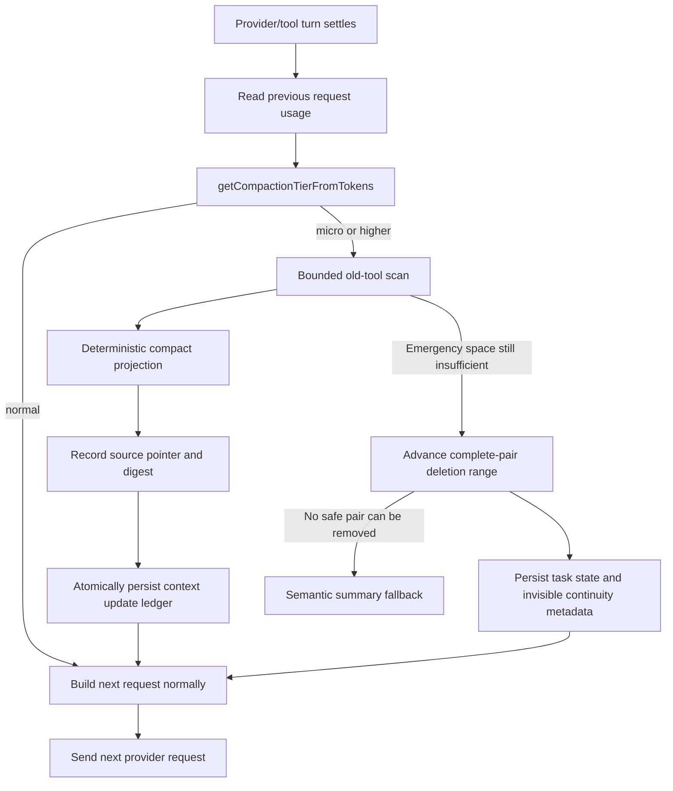

# Recoverable Context Compaction

Status: Implemented
Last validated: 2026-07-26
Primary code: `src/core/context/`, `src/core/task/index.ts`, and `src/core/task/tools/subagent/SubagentRunner.ts`

## Purpose

This document explains why LUMI compacts agent context, how the implementation works, what “recoverable” means, and which invariants must remain true when the subsystem changes.

The short version:

- The durable conversation or governed subagent transcript is the source of truth.
- Compaction changes only the prompt projection sent on a later request.
- Passive work runs after one turn has settled and before the next provider request.
- An emitted provider stream is never compacted or retried in place.
- Every pass has fixed work and output limits.
- Old tool evidence can be reduced progressively; recent and unrecognized evidence stays raw.
- Emergency rollover excludes complete historical pairs from the prompt without deleting them from durable history or adding a model-visible alert.

Progressive tiers are active when `useAutoCondense` is enabled. With automatic condense disabled, the main task retains the legacy hard-allowance truncation path and subagents remain at `normal` until the hard allowance requires `emergency`.

## Why This Was Implemented

Long-running coding agents accumulate context faster than ordinary chat:

- `read_file` results may contain thousands of lines.
- Search, test, build, web, MCP, and subagent results contain large logs.
- Large-repository traversal repeats file content and structural evidence.
- Cache reads and writes still contribute to effective request usage.
- A single pathological result can be large enough that pruning it naïvely creates another memory spike.

The former emergency path depended primarily on semantic summarization. That approach remains a last fallback, but it has undesirable default-path properties:

- It consumes another model/tool turn.
- It can introduce visible summarization or truncation text into the agent conversation.
- It creates a new semantic interpretation of old evidence.
- It adds latency and model cost precisely when the request is already under pressure.
- It cannot honestly promise that omitted details are recoverable.

The implementation therefore separates durable evidence from the bounded prompt view. This is the same broad distinction used by durable workflow systems: persistence owns exact state; execution consumes an appropriate projection of that state.

## Goals

1. Keep agents operating across long tasks and large repositories without routinely exhausting provider context windows.
2. Avoid interrupting active API streams, tool streams, or child work.
3. Preserve exact source evidence outside the compact prompt.
4. Start small and increase compression only as pressure rises.
5. Bound CPU-adjacent work, temporary allocations, scanned messages, inspected blocks, transformed blocks, and output size.
6. Use one threshold authority for parent and subagent paths.
7. Preserve recent evidence and avoid compacting unknown formats.
8. Make behavior deterministic, testable, and observable through existing telemetry.

## Non-Goals

- A compact projection is not a lossless encoding of the original text.
- The `ast_prune` tier does not build a parser AST. It uses conservative, language-aware declaration patterns.
- The subsystem does not replace durable transcripts, checkpoints, or cognitive memory.
- It does not depend on one provider’s server-side context-management feature.
- It does not guarantee constant CPU time for hashing a single enormous source block; exact full-source hashing is intentionally linear.

## Terminology

| Term | Meaning |
| --- | --- |
| Durable source | The complete API conversation history or governed subagent transcript. |
| Request projection | The smaller message view prepared for one provider request. |
| Context update ledger | `context_history.json`, which records timestamped projection substitutions without overwriting the durable source. |
| Recoverable reference | Source artifact plus message/block coordinates, SHA-256 digest, and original size metadata. |
| Passive compaction | Bounded projection work performed between completed turns. |
| Rollover | Excluding complete old user/assistant pairs from the next prompt while retaining them in durable history. |
| Semantic summarization | A model-generated summary. It is now a fallback when deterministic projection and safe rollover cannot advance. |

“Recoverable” means the exact original bytes remain available in the named durable artifact and can be verified by digest. It does not mean the prompt projection contains every original fact.

The legacy tier name `zero_loss_ledger` should be read in that recovery sense. It is not a claim of semantically lossless compression.

## Architecture



There is no edge from an active stream callback into compaction. Main-task context work occurs while constructing the next request. Subagent retry logic additionally tracks whether any chunk has been emitted; once true, the current stream error is propagated without compaction or retry.

## Threshold Authority

`src/core/context/context-management/context-window-utils.ts` is the single tier authority.

First, it computes the provider’s hard allowance:

| Reported context window | Hard allowance |
| ---: | ---: |
| 64,000 | 37,000 |
| 128,000 | 98,000 |
| 200,000 | 160,000 |
| Other | `max(contextWindow - 40,000, floor(contextWindow × 0.8))` |

Progressive thresholds are derived monotonically from that allowance:

| Tier | Trigger |
| --- | ---: |
| `normal` | Below 55% |
| `micro` | 55% |
| `ast_prune` | 68% |
| `zero_loss_ledger` | 78% |
| `emergency` | 86% |

The hard allowance remains the outer fence. Progressive work starts earlier so cheap reductions happen before an emergency request.

`getTokenSafetyProfile()` also exposes diagnostic reservations:

- 10,000 tokens for the system prompt.
- The model’s configured output allowance, or 8,192 by default.
- A safety margin of the larger of 4,096 tokens or 6% of the context window.

Custom auto-condense settings cannot force pathological behavior. They are clamped between the passive `micro` floor and the `emergency` ceiling.

## Per-Tier Work Budgets

`ContextManager.getProgressiveCompactionLimits()` defines the bounded work performed in one pass:

| Tier | Messages scanned | Blocks inspected | Blocks transformed | Recent messages preserved | Minimum source lines | Maximum projected lines |
| --- | ---: | ---: | ---: | ---: | ---: | ---: |
| `micro` | 160 | 64 | 8 | 8 | 600 | 180 |
| `ast_prune` / `semantic_compact` | 320 | 128 | 16 | 6 | 320 | 140 |
| `zero_loss_ledger` | 640 | 256 | 32 | 4 | 160 | 100 |
| `hyper_compressed` / `emergency` | 1,200 | 512 | 64 | 2 | 80 | 72 |

Message and block cursors are separate. If a single message contains more blocks than one pass may inspect, the next pass resumes at the next block rather than rescanning the message prefix. When the active deleted-range start changes, both cursors reset because the projection coordinate system changed.

The legacy duplicate-file-read optimizer is also limited to the active tier’s message budget when invoked through the emergency optimization path.

## Eligible Evidence

Progressive compaction considers old user messages containing supported tool results. It understands both:

- Text-formatted results such as `[read_file for 'src/file.ts'] Result:`.
- Native `tool_result` blocks matched to the preceding assistant `tool_use`.

Current supported high-volume result families are:

- `read_file`
- `execute_command`
- `search_files`
- `list_files`
- `list_code_definition_names`
- `project_map`
- `web_fetch` and `web_search`
- MCP tool/resource access
- cognitive-memory queries
- subagent results

Safety exclusions include:

- Recent messages protected by the current tier.
- Short results below the tier’s line threshold.
- Unknown tool names or unrecognized result formats.
- Existing non-recoverable context updates.
- Projections that would not save at least 10% versus the original.
- Refinements that would not improve an existing projection by at least 5%.

File mutation payloads are not part of the general bounded-output set. The older duplicate-file optimization may still replace repeated `final_file_content` evidence. `execute_command` output is eligible because it is usually log-shaped even when the command itself mutated the workspace; its exact source remains recoverable.

## Projection Algorithms

### Code and file reads

`ContextPruner.skeletonizeCode()` keeps:

- Head and tail context.
- Exported and top-level types.
- Classes, interfaces, enums, structs, traits, modules, and namespaces.
- Function and method signatures.
- Imports, annotations, and documentation anchors.

The name “AST skeleton” in projection markers describes the structural result. The implementation intentionally remains dependency-free and pattern-based, so it does not carry parser startup or grammar costs in the request path.

### Commands, tests, searches, and logs

`ContextPruner.compressCommandOutput()` keeps a bounded selection of:

- Head and tail output.
- Failure, exception, fatal, panic, and assertion lines.
- Nearby context around failures.
- Stack frames and causal lines.
- Test summaries, durations, exit codes, and process-exit evidence.

Error-dense output still obeys the maximum line budget. Evidence ranking chooses which failures survive in the prompt; the full log remains in the durable source.

### Pathological individual payloads

Calling `split("\n")` on an unbounded result can allocate a large temporary array. Before line analysis, the pruner therefore:

1. Counts lines in the full source without allocating a line array.
2. Computes SHA-256 over the full source.
3. If the source exceeds 2,000,000 characters, creates eight deterministic windows spanning the complete source.
4. Materializes only those windows and omission markers for structural/evidence analysis.
5. Reports the full original character and line counts in recovery metadata.

This bounds line-analysis materialization while retaining exact integrity evidence. Full-source hashing and line counting remain linear by design.

## Recovery References and Persistence

A projected block begins with a marker shaped like:

```text
[recoverable_projection ref="api_conversation_history.json#42:0" sha256="<64 hex characters>" original_lines="1800"]
```

The reference contains:

- The actual source artifact.
- Original message index.
- Original block index.
- SHA-256 of the complete source block.
- Original line count.

Main tasks use `api_conversation_history.json`. Subagents use their governed transcript artifact path when available; they must not point at the parent history file.

The reference is currently a verifiable recovery pointer, not an automatic rehydration API. A maintainer or future recovery reader can locate the exact source block and confirm its digest; this pass does not silently restore omitted content into a live prompt.

Projection substitutions are stored in `context_history.json` as timestamped updates. `ContextManager` serializes saves through `p-mutex` and uses `writeAtomic()`, preventing overlapping writes and partial replacement.

Applying a projection deep-clones the outbound message before changing text. The durable `apiConversationHistory` object supplied as the source is not mutated.

Higher tiers may append a stricter projection update for the same source coordinate. Timestamp truncation can remove later updates when restoring an older conversation checkpoint.

## Silent Complete-Pair Rollover

If deterministic projection does not reduce estimated usage below the ledger threshold, `Task.applySilentTurnBoundaryContextRollover()` advances the existing deleted-range projection.

The rollover:

1. Chooses half or quarter retention based on current usage versus the provider allowance.
2. Removes only complete historical pairs from the request view.
3. Preserves the first user/assistant pair.
4. Runs the existing `PreCompact` hook with a transparent-recoverable strategy label.
5. Persists the new deleted range before the next request.
6. Records the first retained assistant text byte-for-byte with internal `silent-compaction-v2` metadata.
7. Emits the existing auto-compaction telemetry event.

No warning, summary prompt, or synthetic continuity marker is added to the model-visible conversation.

The durable conversation still contains the excluded messages. If too few complete pairs exist for the range to advance safely, the legacy semantic-summary path remains available.

## Subagent Behavior

Subagents classify the previous request with the same `getCompactionTierFromTokens()` function.

- `micro`, `ast_prune`, and `zero_loss_ledger` apply in-memory request projections.
- `emergency` may additionally quarter-roll the active subagent conversation.
- Recovery references name the governed subagent transcript artifact.
- Compaction events are written to transcript/envelope evidence when rollover occurs.
- A stream may be retried only before it emits its first chunk.
- After any chunk is emitted, context errors and initialization failures propagate without compaction or retry.

Subagents create an in-memory `ContextManager` for a projection attempt. Already projected blocks remain identifiable in the active conversation, but long-lived cursor state is not persisted across new runner-manager instances. Emergency rollover remains the terminal pressure-release mechanism for histories beyond a single bounded scan horizon.

## Failure Semantics

| Failure | Behavior |
| --- | --- |
| No eligible result is found | Leave the prompt unchanged; emergency path may roll complete pairs. |
| Projection is too large | Reject that projection and preserve the raw outbound block. |
| Context-ledger save fails | Log the error; durable source remains authoritative. |
| `PreCompact` hook cancels | Propagate cancellation and stop rollover. |
| `PreCompact` hook otherwise fails | Log and continue with the bounded rollover path. |
| Provider rejects context before first chunk | Subagent may compact and retry within its attempt limit. |
| Provider fails after a chunk | Do not compact or retry the active stream. |
| Recovery digest does not match | A recovery consumer must reject the source/reference pair. The current compactor records pointers but does not perform automatic rehydration. |

## Observability

- Silent main-task rollover uses `TelemetryService.EVENTS.TASK.AUTO_COMPACT`.
- Task and subagent logs include the selected tier or rollover endpoint.
- `ProgressiveCompactionResult` reports scanned messages/blocks, transformed blocks, original/projected characters, updated message indices, and recovery references to callers and tests.
- `context_history.json` is the durable audit of prompt substitutions.
- Governed subagent transcripts contain compaction events for subagent rollover.

## Implementation Map

| Responsibility | File |
| --- | --- |
| Shared tiers, limits, results, recovery contracts | `src/core/context/context-management/ContextCompactionTypes.ts` |
| Provider allowance, reservations, tier selection | `src/core/context/context-management/context-window-utils.ts` |
| Bounded code/log projection and full-source sampling | `src/core/context/ContextPruner.ts` |
| Eligibility, cursors, updates, atomic persistence, rollover metadata | `src/core/context/context-management/ContextManager.ts` |
| Main-task request-boundary rollover and telemetry | `src/core/task/index.ts` |
| Subagent projection, governed transcript pointers, stream guard | `src/core/task/tools/subagent/SubagentRunner.ts` |
| Pruner unit and pathological-payload tests | `src/core/context/__tests__/ContextPruner.test.ts` |
| Manager tier, recovery, budget, cursor, and persistence tests | `src/core/context/context-management/__tests__/ContextManager.test.ts` |
| Subagent tier, transcript, lifecycle, and stream tests | `src/core/task/tools/subagent/__tests__/SubagentRunner.test.ts` |

## Validation

Focused context proof:

```sh
TS_NODE_PROJECT=./tsconfig.unit-test.json npx mocha --no-config -r ts-node/register -r tsconfig-paths/register -r source-map-support/register -r ./src/test/requires.cjs src/core/context/__tests__/ContextPruner.test.ts src/core/context/context-management/__tests__/ContextManager.test.ts
```

Subagent proof:

```sh
npm rebuild better-sqlite3
TS_NODE_PROJECT=./tsconfig.unit-test.json npx mocha --no-config -r ts-node/register -r tsconfig-paths/register -r source-map-support/register -r ./src/test/requires.cjs src/core/task/tools/subagent/__tests__/SubagentRunner.test.ts
npm run rebuild:electron:better-sqlite3
```

Always restore the Electron-native `better-sqlite3` binary after Node/Mocha database tests.

Supporting checks:

```sh
npx tsc --noEmit --incremental --pretty false
npm run check:handler-imports
npm run check:task-lifecycle-boundary
git diff --check
```

Evidence from the implementation pass:

- Context suites: 43 passing.
- Complete subagent suite: 17 passing.
- TypeScript, handler-import, task-lifecycle boundary, targeted Biome, and diff checks passed.

## Change Checklist

When changing this subsystem:

1. Keep tier selection centralized.
2. Verify every compaction call occurs at a completed-turn/request boundary.
3. Preserve the durable source and source-qualified digest reference.
4. Keep message, inspected-block, transformed-block, candidate, source-materialization, and output budgets explicit.
5. Test block-heavy messages and pathological individual payloads.
6. Test both text-formatted and native `tool_result` content.
7. Preserve recent and unknown evidence.
8. Confirm a partial stream is neither compacted nor retried.
9. Run the context and complete subagent suites.
10. Restore the Electron native module after Node database tests.

## Design Lineage

The implementation is provider-neutral, but it follows familiar production patterns:

- Anthropic context editing keeps the client’s full history while clearing selected old tool results before the prompt reaches the model.
- LangGraph separates durable checkpoints from the execution state projected into a step and preserves completed writes for resumption.
- OpenAI Responses exposes compaction as a first-class conversation item instead of treating truncation as invisible string surgery.

References:

- [Anthropic context editing](https://platform.claude.com/docs/en/build-with-claude/context-editing)
- [LangGraph checkpointing](https://langchain-ai.github.io/langgraph/reference/checkpoints/)
- [OpenAI Responses streaming and compaction items](https://platform.openai.com/docs/api-reference/responses-streaming/response/content_part)
- [MEOW-013: Recoverable Turn-Boundary Context Projection](adr/MEOW-013-recoverable-context-projection.md)
